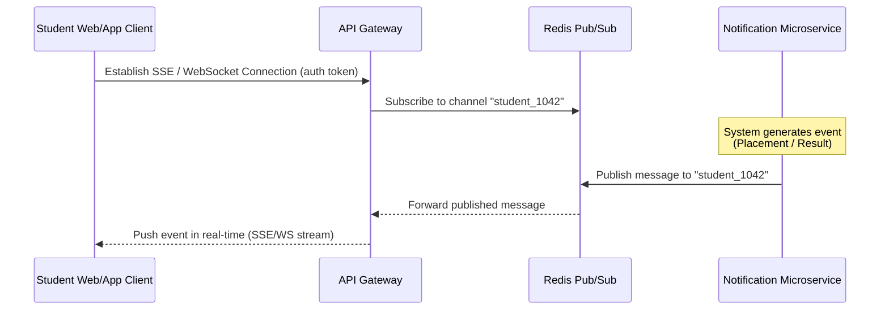

# Notification System Design

This document details the architectural design and analysis for the Campus Notifications Platform.

---

## Stage 1: API Design & Real-Time Notification Mechanism

### REST API Endpoints

#### 1. Retrieve Notifications
* **Method**: `GET`
* **Path**: `/api/notifications`
* **Description**: Fetch paginated notifications for the authenticated student.
* **Query Parameters**:
  - `page` (number, default: 1)
  - `limit` (number, default: 20)
  - `type` (string: "Placement", "Result", "Event")
* **Response (200 OK)**:
  ```json
  {
    "status": "success",
    "results": 2,
    "page": 1,
    "totalPages": 5,
    "data": [
      {
        "id": "c62f2324-5d55-4d1e-96ee-6e7831d6c23c",
        "studentId": 1042,
        "type": "Placement",
        "message": "Company X is recruiting tomorrow at 9 AM.",
        "isRead": false,
        "createdAt": "2026-05-30T11:49:00Z"
      },
      {
        "id": "e44c2111-3c22-4a7a-8f1e-c67083afad12",
        "studentId": 1042,
        "type": "Result",
        "message": "Maths mid-sem results are out.",
        "isRead": true,
        "createdAt": "2026-05-30T10:15:00Z"
      }
    ]
  }
  ```

#### 2. Retrieve Specific Notification
* **Method**: `GET`
* **Path**: `/api/notifications/:id`
* **Response (200 OK)**:
  ```json
  {
    "status": "success",
    "data": {
      "id": "c62f2324-5d55-4d1e-96ee-6e7831d6c23c",
      "studentId": 1042,
      "type": "Placement",
      "message": "Company X is recruiting tomorrow at 9 AM.",
      "isRead": false,
      "createdAt": "2026-05-30T11:49:00Z"
    }
  }
  ```

#### 3. Create Notification (Admin / System Triggered)
* **Method**: `POST`
* **Path**: `/api/notifications`
* **Request Body**:
  ```json
  {
    "studentId": 1042,
    "type": "Placement",
    "message": "Company X is recruiting tomorrow at 9 AM."
  }
  ```
* **Response (210 Created)**:
  ```json
  {
    "status": "success",
    "data": {
      "id": "c62f2324-5d55-4d1e-96ee-6e7831d6c23c",
      "studentId": 1042,
      "type": "Placement",
      "message": "Company X is recruiting tomorrow at 9 AM.",
      "isRead": false,
      "createdAt": "2026-05-30T12:00:00Z"
    }
  }
  ```

#### 4. Update Notification (e.g., Mark as Read)
* **Method**: `PUT`
* **Path**: `/api/notifications/:id`
* **Request Body**:
  ```json
  {
    "isRead": true
  }
  ```
* **Response (200 OK)**:
  ```json
  {
    "status": "success",
    "data": {
      "id": "c62f2324-5d55-4d1e-96ee-6e7831d6c23c",
      "isRead": true
    }
  }
  ```

#### 5. Delete Notification
* **Method**: `DELETE`
* **Path**: `/api/notifications/:id`
* **Response (204 No Content)**: (Empty body)

---

### JSON Schemas

#### POST `/api/notifications` Schema
```json
{
  "$schema": "http://json-schema.org/draft-07/schema#",
  "title": "CreateNotificationRequest",
  "type": "OBJECT",
  "properties": {
    "studentId": {
      "type": "integer",
      "minimum": 1
    },
    "type": {
      "type": "string",
      "enum": ["Placement", "Result", "Event"]
    },
    "message": {
      "type": "string",
      "minLength": 3,
      "maxLength": 1000
    }
  },
  "required": ["studentId", "type", "message"],
  "additionalProperties": false
}
```

#### PUT `/api/notifications/:id` Schema
```json
{
  "$schema": "http://json-schema.org/draft-07/schema#",
  "title": "UpdateNotificationRequest",
  "type": "OBJECT",
  "properties": {
    "isRead": {
      "type": "boolean"
    }
  },
  "required": ["isRead"],
  "additionalProperties": false
}
```

---

### Real-Time Notification Mechanism Design
To achieve sub-second notification deliveries directly to student devices without polling overhead, we recommend **Server-Sent Events (SSE)** or **WebSockets**:



1. **Server-Sent Events (SSE)** is preferred over WebSockets because it is a unidirectional stream running over HTTP/2, supports automatic reconnection out of the box, and utilizes standard HTTP headers. WebSockets should be used only if duplex communication is needed.
2. When a connection is established, the client registers its SSE stream. The backend maps the active socket to the `studentID` in-memory or in a connection registry.
3. When a notification is generated, it writes to the primary database, pushes to a **Redis Pub/Sub** channel (matching the student's ID), and is instantly dispatched to the active SSE channel.

---

## Stage 2: Database Selection & Schema Design

### Chosen Database: PostgreSQL
We select **PostgreSQL** (Relational Database Management System) as the primary storage engine.

#### Why PostgreSQL was Selected:
1. **ACID Compliance**: Ensures strong consistency. Placement offers and exam results are critical datasets; we cannot afford write-losses or dirty reads.
2. **Advanced Indexing**: PostgreSQL offers B-Tree, GIN, and Partial Indexes, allowing us to optimize complex queries filtering by unread flags and dates.
3. **Partitioning**: Out-of-the-box support for declarative table partitioning by range or list, which is crucial for handling millions of historical records.
4. **Relational Constraints**: Enforces foreign keys (`studentID` pointing to the main `students` table), preventing orphaned records.

---

### Schema Design (DDL)

```sql
-- Students Table (For Foreign Key reference)
CREATE TABLE students (
    id SERIAL PRIMARY KEY,
    name VARCHAR(255) NOT NULL,
    email VARCHAR(255) UNIQUE NOT NULL,
    created_at TIMESTAMP WITH TIME ZONE DEFAULT CURRENT_TIMESTAMP
);

-- Notifications Table
CREATE TABLE notifications (
    id UUID PRIMARY KEY DEFAULT gen_random_uuid(),
    student_id INT NOT NULL REFERENCES students(id) ON DELETE CASCADE,
    type VARCHAR(50) NOT NULL, -- 'Placement', 'Result', 'Event'
    message TEXT NOT NULL,
    is_read BOOLEAN NOT NULL DEFAULT FALSE,
    created_at TIMESTAMP WITH TIME ZONE DEFAULT CURRENT_TIMESTAMP
);
```

---

### Core Database Queries

#### Insert Notification
```sql
INSERT INTO notifications (student_id, type, message)
VALUES (1042, 'Placement', 'Placement drive for Microsoft starts tomorrow.');
```

#### Fetch Unread Notifications for a Student
```sql
SELECT id, type, message, is_read, created_at
FROM notifications
WHERE student_id = 1042 AND is_read = FALSE
ORDER BY created_at DESC;
```

#### Mark Notification as Read
```sql
UPDATE notifications
SET is_read = TRUE
WHERE id = 'c62f2324-5d55-4d1e-96ee-6e7831d6c23c' AND student_id = 1042;
```

---

### Scaling Strategy
1. **Table Partitioning**: Partition the `notifications` table by range using the `created_at` column. Older partitions (e.g., older than 3 months) can be archived or compressed, keeping the active table size small.
2. **Read/Write Split**: Configure a primary database instance for writes (inserting notifications) and one or more read replicas to serve read queries (page loads).
3. **Connection Pooling**: Use `PgBouncer` to manage high concurrency and avoid spawning OS processes for every connection.

---

## Stage 3: Query Optimization & Indexing Strategy

### Existing Query Analysis
```sql
SELECT *
FROM notifications
WHERE studentID = 1042
  AND isRead = false
ORDER BY createdAt DESC;
```

#### 1. Performance Issues & Query Cost
* With **5,000,000 records**, a full table scan is catastrophic. If no index exists, PostgreSQL must inspect all 5 million rows on every load, leading to high CPU usage, massive I/O reads, and table locks.
* Sorting by `createdAt DESC` forces a costly in-memory sort or disk merge-sort operation (filesort) if the records are not indexed in sorted order.

#### 2. Indexing Strategy
To optimize this query, we must implement a **Composite Index** on columns that filter and sort:
```sql
CREATE INDEX idx_notifications_student_unread 
ON notifications (student_id, is_read, created_at DESC);
```
**Why this works**:
* The database engine performs a binary lookup on `student_id = 1042`.
* It quickly narrows down matching rows using `is_read = false`.
* The index stores the nodes pre-sorted by `created_at DESC`, allowing the engine to return results immediately without doing an active sort.

---

### Evaluating: "Add indexes on every column"
**Verdict: This is a highly detrimental design choice.**

#### Rationale:
1. **Write Overhead**: Every write (`INSERT`, `UPDATE`, `DELETE`) requires modifying not just the table, but also updating every index. This drastically degrades write performance.
2. **Storage Bloat**: Index structures take up memory and disk space. Having an index on every column can double or triple the storage size of the database.
3. **Cache Inefficiency**: Only a fraction of indices can be cached in memory (RAM). Bloated indexing pushes active indexes out of memory, forcing disk operations.
4. **Planner Confusion**: The Query Planner might select suboptimal query paths when presented with too many redundant index options.

---

### Additional Query Requirement
"Write a query to fetch placement notifications from the last 7 days and unread only."

```sql
SELECT id, student_id, type, message, is_read, created_at
FROM notifications
WHERE type = 'Placement'
  AND is_read = FALSE
  AND created_at >= NOW() - INTERVAL '7 days'
ORDER BY created_at DESC;
```

---

## Stage 4: Cache Architecture (Redis Caching)

### Caching Architecture
When a student logs in or loads their inbox, the application checks the cache (Redis) first. If a cache miss occurs, the data is fetched from the PostgreSQL database, cached in Redis, and returned.

```text
Student Client ---> Express Server ---> [ Redis Cache (Fast Lookup) ]
                             | (Cache Miss)
                             v
                 [ PostgreSQL Primary / Replica ]
```

### Cache Invalidation Strategy
We implement a **Cache-Aside** (Lazy Loading) strategy combined with **Write-Through Invalidation**:
1. When a new notification is created for `student_1042`, the backend inserts it into PostgreSQL and immediately purges/evicts the cache key `student_1042:unread` in Redis.
2. When the student marks a notification as read, the database is updated, and the key `student_1042:unread` is deleted from Redis.
3. To prevent stale data, set a **Time-To-Live (TTL)** of `3600 seconds` (1 hour) on all keys.

### Benefits and Tradeoffs
* **Benefits**:
  - Extremely fast response times (sub-milliseconds) because Redis operates in-memory.
  - Offloads read stress from the PostgreSQL database.
* **Tradeoffs**:
  - Cache Consistency: If a write fails to invalidate the cache, users will see stale notifications.
  - Memory Cost: Redis stores data in RAM, which is more expensive than disk storage.

---

## Stage 5: Message Queue System for Bulk Processing

### Critique of the Existing Design
The current implementation runs synchronously in a linear loop:
```python
function notify_all(student_ids, message):
    for student_id in student_ids:
        send_email(student_id, message)
        save_to_db(student_id, message)
        push_to_app(student_id, message)
```

#### Problems:
1. **Blocking Thread / Timeout**: Executing SMTP sends, DB writes, and push notifications for 50,000 students sequentially inside an HTTP request will block the server thread. The connection will time out, crashing the request.
2. **Cascade Failures**: If one SMTP call fails or is slow (e.g. takes 2 seconds), it delays all subsequent notifications.
3. **No Resiliency**: If the server crashes on student index 10,000, there is no way to resume. 10,000 students received the message, and 40,000 did not, with no logging or recovery.
4. **Rate Limiting**: Sending 50,000 SMTP requests rapidly without rate limiting will cause external mail services (SES, SendGrid) to block or flag the sender.

---

### Improved Architecture (Message Queue / Broker)

```text
[ HR Portal Admin ] ---> [ Express REST API ]
                                  |
                           (Publish Job)
                                  v
                        [ RabbitMQ / Kafka ] (Job Queue)
                                  |
                     (Consume Jobs concurrently)
                                  v
                   [ Worker Pool (Auto-scaling) ]
                     /            |            \
       (Send Mail)  /    (Write DB) \    (Push App) \
                   v              v              v
            [ SES/SMTP ]    [ PostgreSQL ]    [ Firebase / APNS ]
```

1. **Job Queueing**: The HTTP route merely pushes a single "bulk broadcast job" to a queue and immediately returns a `202 Accepted` response.
2. **Asynchronous Consumers**: Worker processes pull jobs from the queue and send notifications concurrently. If a worker crashes, the queue manager automatically re-queues the message.
3. **Dead Letter Queue (DLQ)**: When a mail send fails after a set number of retries (e.g., 3), the job is routed to a Dead Letter Queue for admin inspection, keeping the main queue flowing.
4. **Idempotency**: Assign a unique `notification_hash` or `message_id` to each transaction. Workers check this against Redis before sending to prevent duplicate mail deliveries in retry loops.

---

### Improved Pseudocode

```javascript
// REST Controller: Enqueues Bulk Job
async function triggerBulkNotification(req, res) {
  const { studentIds, message } = req.body;
  const jobId = generateUuid();
  
  // Publish a payload describing the job to the Queue
  await messageQueue.publish("bulk_notifications_channel", {
    jobId,
    studentIds,
    message,
    timestamp: new Date().toISOString()
  });

  // Instantly return HTTP response to HR Portal, releasing the thread
  return res.status(202).json({
    status: "accepted",
    message: "Bulk notification queued successfully",
    jobId
  });
}

// Background Worker Processor (Subscription Consumer)
async function startNotificationWorker() {
  messageQueue.subscribe("bulk_notifications_channel", async (jobPayload) => {
    const { studentIds, message, jobId } = jobPayload;
    
    for (const studentId of studentIds) {
      // Publish individual tasks to divide and conquer across parallel workers
      await messageQueue.publish("individual_send_channel", {
        jobId,
        studentId,
        message,
        retryCount: 0
      });
    }
  });

  // Worker for individual notifications
  messageQueue.subscribe("individual_send_channel", async (task) => {
    const { studentId, message, retryCount } = task;
    const idempotencyKey = `notification:${studentId}:${message.slice(0, 10)}`;

    try {
      // 1. Check idempotency
      const isAlreadyProcessed = await redis.get(idempotencyKey);
      if (isAlreadyProcessed) return;

      // 2. Process tasks asynchronously
      await Promise.all([
        sendEmail(studentId, message),
        saveToDb(studentId, message),
        pushToApp(studentId, message)
      ]);

      // 3. Mark as processed
      await redis.set(idempotencyKey, "success", "EX", 86400); // 1 day expire
      
    } catch (error) {
      if (retryCount < 3) {
        // Requeue with backoff
        await messageQueue.publish("individual_send_channel", {
          ...task,
          retryCount: retryCount + 1
        });
      } else {
        // Publish to Dead Letter Queue (DLQ)
        await messageQueue.publish("failed_notifications_dlq", {
          ...task,
          error: error.message,
          failedAt: new Date().toISOString()
        });
      }
    }
  });
}
```
